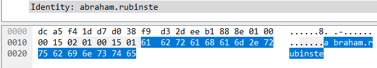
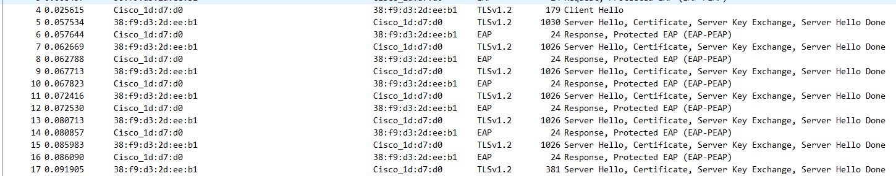
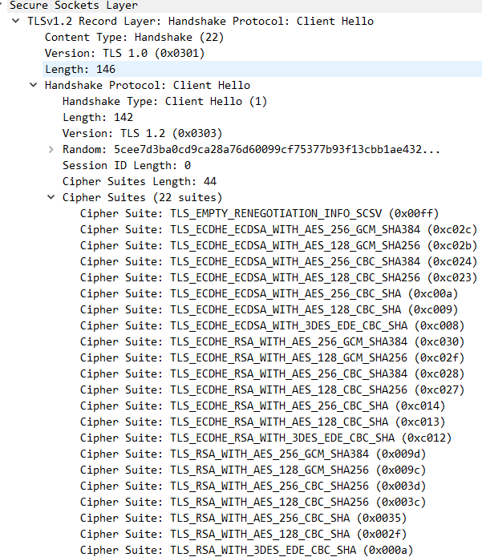
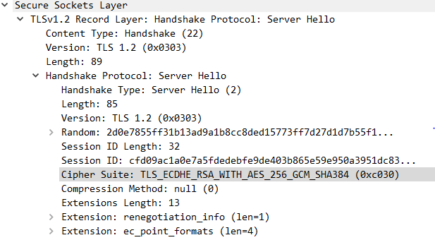
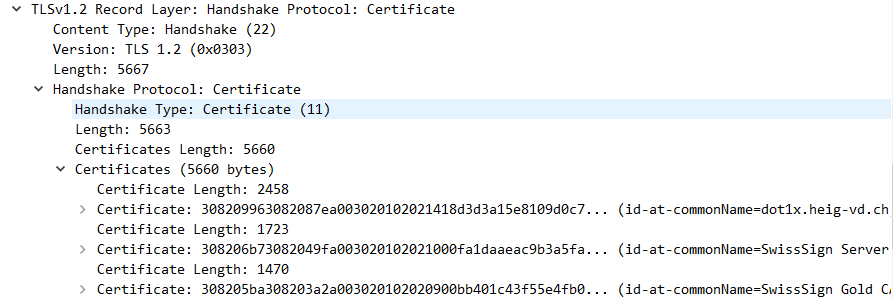
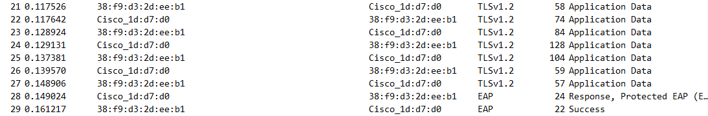

# Sécurité des réseaux sans fil

## Laboratoire 802.11 Sécurité WPA Entreprise

### 1. Capture et analyse d’une authentification WPA Entreprise

Analyse de la capture

les trames de requêtes et réponses d'authentification sont les deux premières de la capture.

on peut ensuite trouver l'identité de l'utilisateur dans la trame de réponse du serveur.

Ensuite il y a la phase hello :

De cette capture, on peut déjà voire la version de TLS, ici TLS 1.2.
En allant ensuite inspecter le paquet Client Hello, on peut trouver les suites cryptographiques proposés par le client ainsi que les nounces (champ Random) et les sessions ID

Ensuite on peut avoir la suite utilisée dans la serveur hello.

Après, il y à la transmission des certificats. On peut aussi trouver cette information dans les trames Server Hello :

Puis, il y a la phase de key exchange  

Après, il y a l'échange de la clé WPA comme la montre la caputre suivante.

Pour finir il y a une phase de 4 way handshake, mais malheureusement, elle n'était pas présente dans la caputre fournie. Cette partie se trouve donc après avoir reçu le trame success de la part du serveur.

### Répondez aux questions suivantes :

> **_Question :_** Quelle ou quelles méthode(s) d’authentification est/sont proposé(s) au client ?
>
> **_Réponse :_**
 Dans la trame Request, Protected EAP (3ème trame de la capture), on peut voir que les types proposés sont EAP-PEAP et EAP-TLS

---

> **_Question:_** Quelle méthode d’authentification est utilisée ?
>
> **_Réponse:_** EAP-PEAP
---

> **_Question:_** Lors de l’échange de certificats entre le serveur d’authentification et le client :
>
> - Le serveur envoie-t-il un certificat au client ? Pourquoi oui ou non ?
>
> **_Réponse:_**
>  Oui le serveu envoie toujours son certificat, cette partie etant dans protocole EAP-PEAP
> - b.	Le client envoie-t-il un certificat au serveur ? Pourquoi oui ou non ?
>
> **_Réponse:_**
> Le client n'envoie pas son certificat car la trame TLS certificat request de la part du serveur n'est pas incule dans EAP-PEAP

---

### 2. Attaque WPA Entreprise

Après avoir modifié le fichier de configuration avec le bon SSID et le bon nom d'interface, dans notre cas wlan0mon, nous pouvons capturer une authentification.

A partir de cette capture nous pouvons alors lancer un outil afin de craquer le hash de l'utilisateur qui s'est authentifié. Nous avons décidé d'utiliser hashcat.

Au final, on retrouve le mot de passe utilisé lors de l'authentification comme le montre l'image ci dessous.

> **_Question :_** Quelles modifications sont nécessaires dans la configuration de hostapd-wpe pour cette attaque ?
>
> **_Réponse :_** Les changements qui ont été apporté aux fichiers de configuration sont le nom du SSID et le nom de l'interface, tout le reste a été laissé tel quel (par défaut la configuration utilise le mode 2.4Ghz).

---

> **_Question:_** Quel type de hash doit-on indiquer à john pour craquer le handshake ?
>
> **_Réponse:_** Nous avons utilisé hashcat pour cracker le hash. Le type de hash à indiquer est NetNTLMv1, correspondant aux code 5500.

---

> **_Question:_** 6.	Quelles méthodes d’authentification sont supportées par hostapd-wpe ?
>
> **_Réponse:_** D'après la documentation (https://tools.kali.org/wireless-attacks/hostapd-wpe), les methodes d'authentifications supportées sont :
>
> - EAP-FAST/MSCHAPv2 (Phase 0)
> - PEAP/MSCHAPv2
> - EAP-TTLS/MSCHAPv2
> - EAP-TTLS/MSCHAP
> - EAP-TTLS/CHAP
> - EAP-TTLS/PAP
