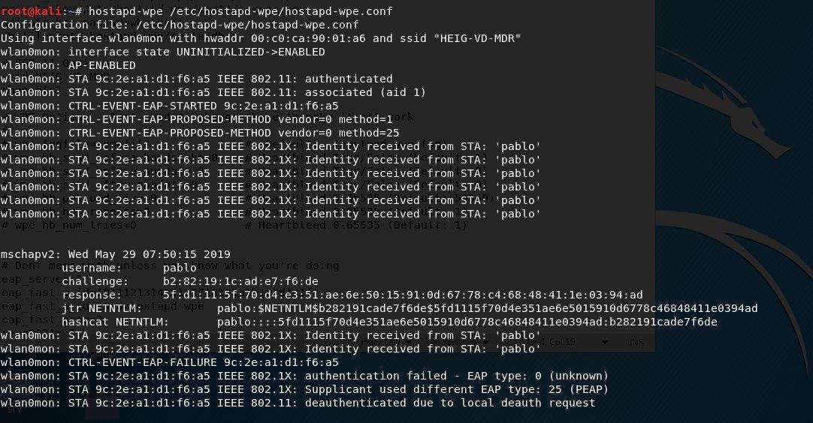

# Sécurité des réseaux sans fil

## Laboratoire 802.11 Sécurité WPA Entreprise

### 1. Capture et analyse d’une authentification WPA Entreprise

Dans cette première partie, vous allez capturer une connexion WPA Entreprise au réseau de l’école avec Wireshark et fournir des captures d’écran indiquant dans chaque capture les données demandées.

- Identifier le canal utilisé par l’AP dont la puissance est la plus élevée. Vous pouvez faire ceci avec ```airodump-ng```, par exemple
- Lancer une capture avec Wireshark
- Etablir une connexion depuis un poste de travail (PC), un smartphone ou une tablette. Attention, il est important que la connexion se fasse à 2.4 GHz pour pouvoir sniffer avec les interfaces Alfa.
- Comparer votre capture au processus d’authentification expliqué en classe (n’oubliez pas les captures !). En particulier, identifier les étapes suivantes :
	- Requête et réponse d’authentification système ouvert
 	- Requête et réponse d’association
	- Sélection de la méthode d’authentification
	- Phase d’initiation. Arrivez-vous à voir l’identité du client ?
	- Phase hello :
		- Version TLS
		- Suites cryptographiques et méthodes de compression proposées par le client et acceptées par l’AP
		- Nonces
		- Session ID
	- Phase de transmission de certificats
	 	- Certificat serveur
		- Change cipher spec
	- Authentification interne et transmission de la clé WPA (échange chiffré, vu comme « Application data »)
	- 4-way hadshake

### Répondez aux questions suivantes :

> **_Question :_** Quelle ou quelles méthode(s) d’authentification est/sont proposé(s) au client ?
> 
> **_Réponse :_** 

---

> **_Question:_** Quelle méthode d’authentification est utilisée ?
> 
> **_Réponse:_** 

---

> **_Question:_** Lors de l’échange de certificats entre le serveur d’authentification et le client :
> 
> - Le serveur envoie-t-il un certificat au client ? Pourquoi oui ou non ?
> 
> **_Réponse:_**
> 
> - b.	Le client envoie-t-il un certificat au serveur ? Pourquoi oui ou non ?
> 
> **_Réponse:_**
> 

---

### 2. Attaque WPA Entreprise

Après avoir modifié le fichier de configuration avec le bon SSID et le bon nom d'interface, dans notre cas wlan0mon, nous pouvons capturer une authentification.



A partir de cette capture nous pouvons alors lancer un outil afin de craquer le hash de l'utilisateur qui s'est authentifié. Nous avons décidé d'utiliser hashcat.

Au final, on retrouve le mot de passe utilisé lors de l'authentification comme le montre l'image ci dessous.


> **_Question :_** Quelles modifications sont nécessaires dans la configuration de hostapd-wpe pour cette attaque ?
> 
> **_Réponse :_** Les changements qui ont été apporté aux fichiers de configuration sont le nom du SSID et le nom de l'interface, tout le reste a été laissé tel quel (par défaut la configuration utilise le mode 2.4Ghz).

---

> **_Question:_** Quel type de hash doit-on indiquer à john pour craquer le handshake ?
> 
> **_Réponse:_** Nous avons utilisé hashcat pour cracker le hash. Le type de hash à indiquer est NetNTLMv1, correspondant aux code 5500.

---

> **_Question:_** 6.	Quelles méthodes d’authentification sont supportées par hostapd-wpe ?
>
> **_Réponse:_** D'après la documentation (https://tools.kali.org/wireless-attacks/hostapd-wpe), les methodes d'authentifications supportées sont : 
>
> - EAP-FAST/MSCHAPv2 (Phase 0)
> - PEAP/MSCHAPv2
> - EAP-TTLS/MSCHAPv2
> - EAP-TTLS/MSCHAP
> - EAP-TTLS/CHAP
> - EAP-TTLS/PAP
